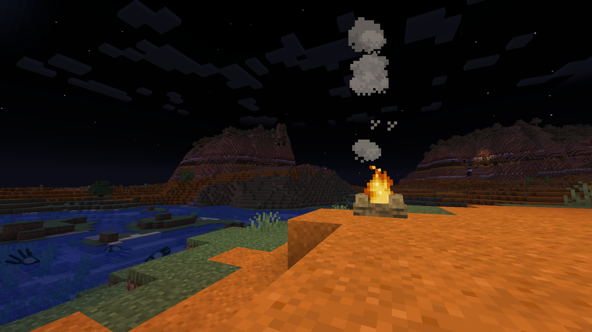
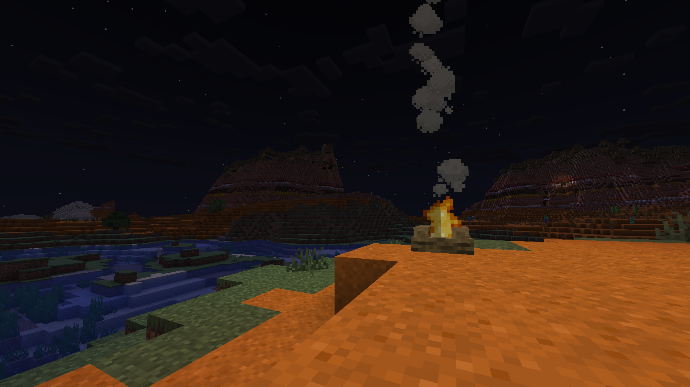

# Lumix shader

Lumix is a shader pack for Minecraft that aims to provide a unique and immersive visual experience. It enhances the game's graphics with custom shaders, textures, and effects, making the world of Minecraft more vibrant and dynamic.

## Comparison: Vanilla vs Lumix Shader

Below are visual comparisons between Vanilla Minecraft and the Lumix Shader. Screenshots are located in the `media` folder.

**Vanilla:**

**Lumix Shader:**

## Installation and Usage

### Prerequisites
- Ensure you have [OptiFine](https://optifine.net/downloads) installed for your version of Minecraft.

### Steps to Install
1. Download the Lumix Shader `.zip` file from the [Releases](https://github.com/fortyup/lumix-shader/releases) section of this repository.
2. Open Minecraft and navigate to the **Options** menu.
3. Go to **Video Settings** > **Shaders**.
4. Click on the **Shaders Folder** button. This will open the shaderpacks folder.
5. Place the downloaded Lumix Shader `.zip` file into the `shaderpacks` folder.
6. Close the folder and return to Minecraft. The Lumix Shader should now appear in the list of available shaders.
7. Select the Lumix Shader and click **Done** to apply it.

### How to Use
- Once the shader is applied, load or create a Minecraft world.
- Enjoy enhanced visuals with the Lumix Shader!

## Author

Made by [@fortyup](https://github.com/fortyup)